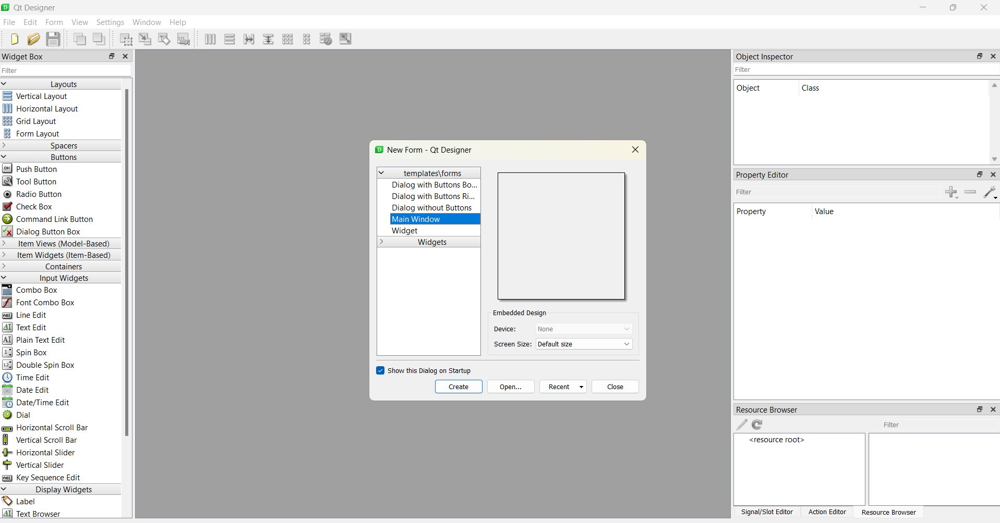
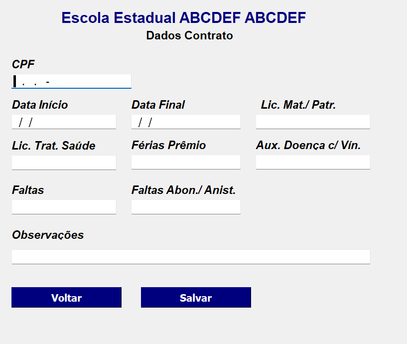
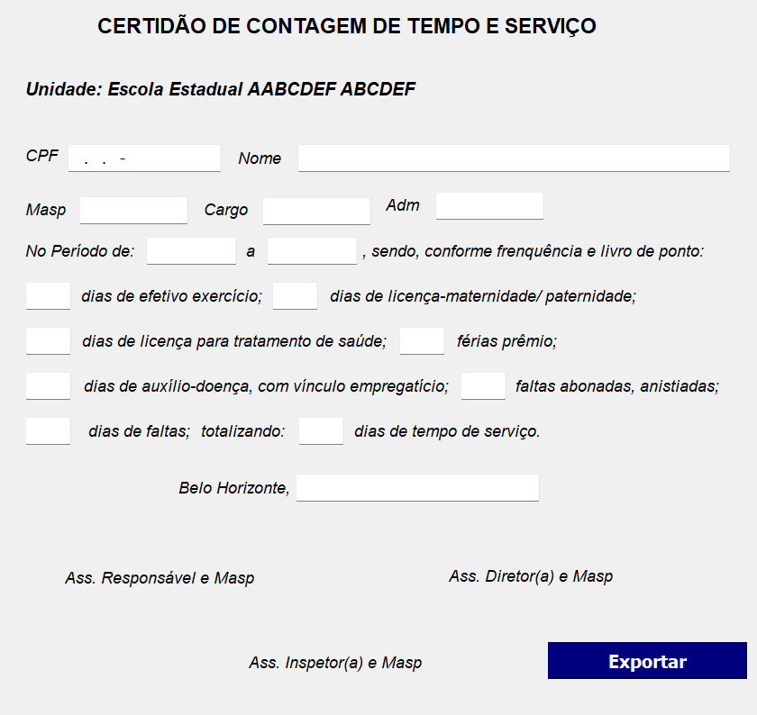
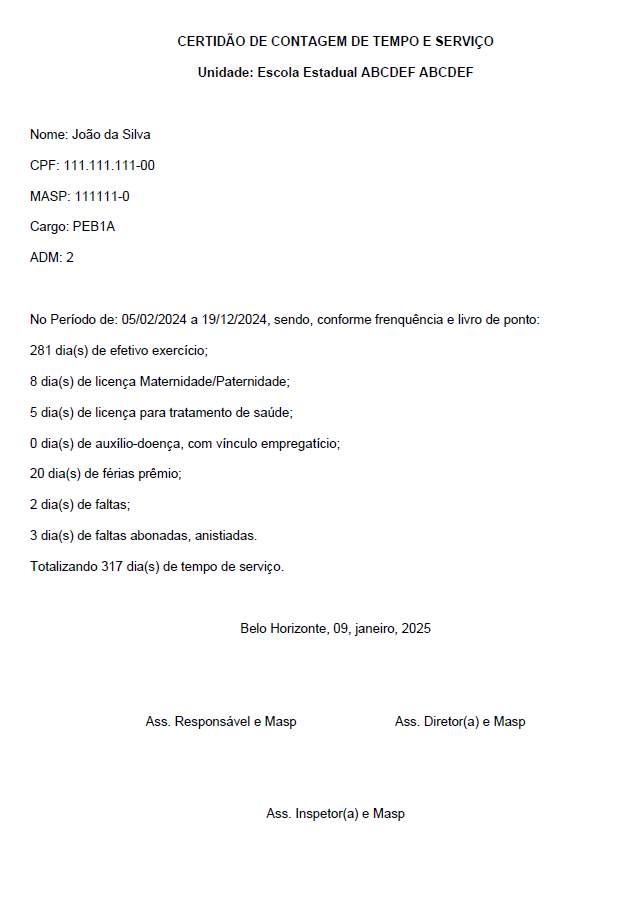

# Atividade Extensionista: Tecnologia Aplicada à Inclusão Digital!

“Atividade que se integra à matriz curricular e à organização da pesquisa, constituindo-se em processo interdisciplinar, político educacional, cultural, científic e tecnológico, que promove a interação transformadora entre as Instituições de Ensino Superior e os outros setores da sociedade, por meio da produção e da aplicação do conhecimento, em articulação permanente com o ensino e a pesquisa”.  
(Fonte: Resolução CNE/CES nº 7, de 18 de dezembro de 2018)

## O projeto

O objetivo do projeto é:

- Criar um software que seja possível realizar o cadastro dos funcionários de uma escola e emitir uma certidão da contagem de tempo de serviço.
- Efetuar o cadastro do mesmo em um banco de dados.
- Exibir telas de fácil acesso e intuitivas, com ações claras e precias, visando a facilidade de operações por pessoas não especializadas em software.
- Melhorar a Eficiência Operacional permitindo uma gestão mais precisa e ágil no departamento de pessoal;
- Facilitar o Monitoramento e Relatórios;
- Emitir certidão de contagem de tempo

## Setor de Aplicação  

O projeto será implementado em uma Escola Estadual na cidade de Belo Horizonte - MG. Ele visa auxiliar e aprimorar os processos do departamento de pessoal, que atualmente realiza a contagem do tempo de trabalhado de forma manual. A solução proposta buscará automatizar essas atividades, promovendo maior eficiência e precisão na gestão do tempo dos funcionários.

## Programas utilizados

- pyqt5: Para o desenvolvimento da interface gráfica do software.
- MySQL: Para criação das tabelas e armazenamento dos dados.
- Python: Para implementação do código.

## Desenvolvimento do software

Para a instalaçao da Interface gráfica foi utilizado o seguinte comando:

~~~Python
pip intstall pyqt5
~~~

E para instalar as ferramentas que facilita o desenvolvimento de telas:

~~~Python
pip install pyqt5-tools
~~~

Após a instalação a interface do pyqt5 e exibida

### Iniciando a criação das telas

- Selecione "Label" e digite o texto desejado.
- Selecione "Fonte" para as configurações desejadas
- Para inserir uma caixa digitável selecione "Line Edite", formate conforme desejado.
- Para organizar as caixas na tela, basta clicar em "Lay out in a Grid" (9 quadradinhos na parte superior).

### Para adicionar botões

- Selecione "Buttons" lado esquerdo
- Selecione "Push Button" e arraste até a caixa do programa
- Insira o título que deseja
- Selecione as configurações desejadas

No PyQt5 foram desenvolvidas três telas principais para interação com o usuário:
1.	**Tela de Cadastro de Servidores "Cadastro"**
* Permite o registro de informações pessoais e profissionais dos servidores, como:  
    *	Dados pessoais: Nome e CPF.  
    *	Dados específicos: Número do MASP, cargo exercido, ADM, situação funcional, função exercida e código do exercício.  
* Funcionalidades:  
    *   Botões para salvar as informações no banco de dados.  
    *   Navegação para a tela de registro de períodos.
    *   Geração de certidão.	
2.	**Tela de Registro de Períodos Trabalhados "Período"**
* Destinada ao registro de informações relacionadas ao tempo de trabalho do servidor.
* Funcionalidades:
    *   Inserção do CPF do servidor para relacionar as informações ao cadastro.
    *   Registro das datas de início e fim do período trabalhado.
    *   Registro de dias de licença (maternidade/paternidade, saúde), férias-prêmio, auxílio-doença com vínculo, faltas e faltas abonadas.
    *   Botões para salvar os dados ou retornar à tela de cadastro.
3.	**Tela de Emissão de Certidão "Relatório"**
* Permite a geração de uma certidão com o resumo do tempo de serviço do servidor.
* Funcionalidades:
    *   Inserção do CPF para consulta.
    *   Exibição de dados como nome do servidor, MASP, cargo, ADM, período de trabalho, licenças, faltas e total do tempo de serviço.
    *   Apresentação da data de emissão e opção para exportar a certidão em PDF.

## Criação do Banco de Dados

O banco de dados foi criado utilizando **MySQL** e conta com duas tabelas principais:
1.	**Tabela Servidores**
* Armazena os dados cadastrais preenchidos na tela de cadastro, como nome, CPF, MASP e cargo.
2.	**Tabela Períodos**
* Armazena informações sobre os períodos trabalhados registrados na segunda tela, incluindo datas de início e fim, licenças, faltas e outros dados relacionados.  
As tabelas estão relacionadas pela coluna CPF, garantindo a integridade dos dados.  
Os comandos utilizados para criar essas tabelas serão apresentados a seguir.

*Código utilizado para criar a base de dados*

~~~MySQL
    create database certidao_contagem_tempo;;
    use certidao_contagem_tempo;;
~~~

*Código utilizado para criar a tabela cadastro

~~~MySQL
    create database certidao_contagem_tempo;;
    use certidao_contagem_tempo;;

    create table servidores(
    id int auto_increment primary key,
    nome varchar (100) not null,
    cpf varchar (11) not null,
    masp varchar (30) not null,
    cargo_exercido varchar (20),
    adm int,
    situacao_funcional varchar (50),
    cargo_funcao_conteudo varchar (30),
    funcao_exercida varchar (100),
    codigo_exercicio int,
    );
~~~

*Código utilizado para criar a tabela período

~~~MySQL
    use certidao_tempo_servico;

    create table periodo(
    id int auto_increment primary key,
    cpf varchar (11) not null,
    data_inicio date not null,
    data_final date not null,
    licenca_mater_pater int,
    licenca_trat_saude int,
    auxilio_doenca int,
    ferias_premio int,
    faltas int,
    faltas_abon_anist int,
    observacoes varchar (400)
    );
~~~

## Implementação do código em python

- Para a criação e interação do código com o banco de dados foi utilizado o seguinte comando:

~~~python
pip install mysql-connector-python
~~~

- Bibliotecas utilizadas

~~~python
from PyQt5 import uic, QtWidgets 
from PyQt5.QtWidgets import QMessageBox
from datetime import datetime
from fpdf import FPDF
import MySQLdb 
import locale
~~~

#### Estrutura do código  
O código foi dividido em cinco módulos principais, descritos a seguir:
1.	**Módulo de Conexão com o Banco de Dados (conect.py)**  
Este módulo contém a função de conexão com o MySQL, incluindo host, usuário, senha e porta.

2.	**Módulo de Cadastro de Servidores (cadastro.py)**  
Este módulo implementa a funcionalidade para cadastrar servidores no sistema. O usuário insere informações como nome, CPF, MASP, cargo exercido, e situação funcional. Após a validação, os dados são inseridos no banco e os campos são automaticamente limpos.

3.	**Módulo de Registro de Períodos de Trabalho (periodo.py)**  
Este módulo permite o registro dos períodos trabalhados por cada servidor, incluindo informações como data de início, data de fim, e tipos de licenças ou faltas ocorridas durante o período. Há validação para garantir o formato correto das datas.

4.	**Módulo de Geração de Relatórios (relatorio.py)**  
Este módulo reúne informações dos servidores e dos períodos registrados para criar relatórios detalhados. O cálculo de dias úteis trabalhados, licenças e faltas é realizado, e os dados são exibidos na interface gráfica. Também foi implementada a funcionalidade para exportar os relatórios em PDF.

5.	**Interface Gráfica e Controle Principal (main.py)**  
Este módulo é responsável pela inicialização do sistema e integração de todas as telas e funcionalidades. Foi utilizada a biblioteca PyQt5 para criar interfaces interativas e intuitivas.

## Instalação do software para o cliente
Para instalar o programa na máquina do cliente, foi necessário instalar o MySQL, criar a base de dados, e para instalar o software foi utilizando os seguintes comandos:

~~~python
pip install pyinstaller
pyinstaller --windowed main.py
~~~

Abaixo estão as telas aque o usuário irá visualizar a pós a instalação do software, e a certidão em PDF gerada pelo sistema em um modelo simples. O layout da certidão pode ser configurado de acordo com o desejo do cliente.

Tela: Cadastro

  

  

Tela: Período

  

  

Tela: Relatório

  

  

Certidão gerada em pdf. Obs: Os dados que constam no documento são fictícios.

  

## Impacto do Sistema

Com a implantação do sistema espera alcançar os seguintes benefícios:
*	Redução do tempo gasto em tarefas manuais: Substituição de planilhas do Excel por um sistema automatizado.
*	Aumento na precisão: Redução de erros humanos nos cálculos de tempo de serviço.
*	Emissão de relatórios confiáveis: Documentos claros e acessíveis em formato PDF.
*	Facilidade de uso: Telas intuitivas que permitem operação por profissionais sem conhecimentos avançados em tecnologia.

## Considerações Finais

Durante o desenvolvimento deste projeto de extensão, diversas lições e desafios foram enfrentados, contribuindo significativamente para o aprendizado acadêmico e prático.
Primeiramente, a importância de compreender e estruturar corretamente um banco de dados relacional, garantindo que as informações armazenadas atendam às necessidades da aplicação de forma eficiente e organizada. O uso de comandos SQL e a manipulação de dados em tempo real foram habilidades amplamente exercitadas.
Em segundo lugar, o projeto proporcionou a oportunidade de aprofundar o conhecimento em tecnologias de interface gráfica, utilizando o PyQt5 para desenvolver telas intuitivas e funcionais que facilitam a interação do usuário com o sistema. Isso demonstrou a relevância de criar soluções tecnológicas que sejam acessíveis e práticas para os usuários finais.
Por último, lidamos com o desafio de integrar diferentes módulos da aplicação, desde a interface do usuário até a geração de relatórios em PDF. Esse processo reforçou a importância de modularidade e organização no código, além de destacar a necessidade de realizar testes exaustivos para garantir a confiabilidade da aplicação.
Embora tenham surgido dificuldades, como a validação de dados e a adaptação às tecnologias utilizadas, cada obstáculo foi uma oportunidade de aprendizado. Com isso conclui se que projetos como este são essenciais para desenvolver habilidades técnicas e de resolução de problemas, preparando-nos para demandas reais do mercado de trabalho.

                     

## Fontes de pesquisa

[Desenvolvimento_de_Sistemas_com_Java_Python_e_MySQL](https://www.udemy.com/course/desenvolvimento-de-sistemas-java-python-e-mysql/)

https://pythonprogramminglanguage.com/pyqt5-message-box/

https://doc.qt.io/qtforpython-5/PySide2/QtWidgets/QComboBox.html

https://www.youtube.com/watch?v=gpTaap6C3EI&list=PLUggkc7RLRtSDmuXG8laeC7d8PzrxAZ4r&index=27

https://www.youtube.com/watch?v=84EbV3Gjqk0

https://www.youtube.com/watch?v=IdgFAr3z5hI

